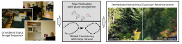

# Immediate 3D Gaussian Splat Reconstruction of Unordered Input with Global Consistency
[Andreas Meuleman](https://ameuleman.github.io/), 
[Linus Franke](https://lfranke.github.io/)*,
[Boris Zhestiankin](https://scholar.google.com/citations?user=192vUNUAAAAJ),
[Camille Montemagni](https://cammonte.com/),
[George Drettakis](https://www-sop.inria.fr/members/George.Drettakis/)

### [Project page](https://repo-sam.inria.fr/nerphys/i3dgs/) | [Paper](https://repo-sam.inria.fr/nerphys/i3dgs/i3dgs.pdf)

<picture>
  <source media="(prefers-color-scheme: dark)" width="100%" srcset="assets/teaser_dark.svg">
  
</picture>

**Table of contents**: [Setup](#setup) | [Data Guidelines](#data-guidelines) | [Optimization](#optimization) | [Evaluation](#evaluation) | [Viewers](#interactive-viewers) | [Citation](#citation) | [Licensing](#licensing) | [Acknowledgments](#acknowledgments)

We propose a 3D Gaussian Splatting reconstruction method with immediate feedback that handles unordered image captures and very large scenes. Through fast place-recognition-driven matching, cluster-based loop closure with graph-propagated correction, and a progressive Gaussian hierarchy construction, it achieves robust, scalable reconstruction at a fraction of offline processing times. 

<!-- Institutions logos -->
<div align="center">
  <a href="https://www.inria.fr/">
    
  </a>
  <a href="https://univ-cotedazur.eu/">
    <picture>
      <source media="(prefers-color-scheme: dark)" width="20%" hspace="1%" srcset="assets/uca_logo_dark.svg">
      
    </picture>
  </a>
  <a href="https://www.univ-rennes.fr/en/">
    <picture>
      <source media="(prefers-color-scheme: dark)" width="18%" hspace="1%" srcset="assets/unirennes_logo_dark.svg">
      
    </picture>
  </a>
  <a href="https://epfl.ch/">
    
  </a>
</div>
<br>
<a href="https://team.inria.fr/graphdeco/">
  <picture>
    <source media="(prefers-color-scheme: dark)" width="23.5%" hspace="1%" srcset="assets/graphdeco_logo_dark.svg">
    
  </picture>
</a>
<a href="https://project.inria.fr/nerphys/">
  <picture>
    <source media="(prefers-color-scheme: dark)" width="16.5%" hspace="1%" srcset="assets/erc_logo_dark.svg">
    
  </picture>
</a>

## Setup 
Tested on Ubuntu 24.04 and Windows 11 with PyTorch 2.7.1 and CUDA 12.8.
<details>
<summary>Windows only</summary>
On Windows, CUDA needs to be installed after the compiler. Tested with MSVC v142 (Visual Studio 2019).
<br>

Use a regular PowerShell or, if compilation fails there (e.g., the wrong Visual Studio version is picked up), use an <i>x64 Native Tools Command Prompt for VS</i> instead and set:
```bash
SET DISTUTILS_USE_SDK=1 # If you use cmd.exe
$env:DISTUTILS_USE_SDK=1 # If you use PowerShell
```
This makes the build reuse the shell's compiler environment instead of auto-detecting one. In a regular shell there might be no compiler environment to reuse, preventing build if <code>DISTUTILS_USE_SDK</code> is set.
</details>

Create the environment:
```bash
git clone --recursive https://github.com/graphdeco-inria/i3dgs.git
cd i3dgs
conda create -n i3dgs python=3.12 -y
conda activate i3dgs
pip install hatchling
# Get the versions corresponding to your compute platform at https://pytorch.org/
pip install torch==2.7.1 torchvision==0.22.1 --index-url https://download.pytorch.org/whl/cu128 # or cu118, or rocm6.3
pip install -r requirements.txt --no-build-isolation
pip install cupy-cuda12x # or cupy-cuda11x, or cupy (for other platforms)
```

<details>
<summary>Installing CUDA within a Conda Environment</summary>
If <code>nvcc --version</code> returns an error, you can install CUDA within your Conda environment. 
After activating your environment and before installing PyTorch, run:
<pre><code>conda install nvidia/label/cuda-12.8.0::cuda-nvcc
</code></pre>
Make sure to replace <code>12.8.0</code> with a version supported by your driver (check maximum version with <code>nvidia-smi</code>). A list of the available versions can be found <a href="https://anaconda.org/nvidia/cuda-nvcc">here</a>.
</details>

<details>
<summary>Specifying Environment Path</summary>
You can specify paths for Conda to save space on your system drive:
<pre><code>conda config --add pkgs_dirs &lt;pkg_path&gt;
conda create python=3.12 -y --prefix &lt;env_path&gt;/i3dgs
conda activate &lt;env_path&gt;/i3dgs
</code></pre>
Where <code>&lt;pkg_path&gt;</code> is the desired package download location and <code>&lt;env_path&gt;/i3dgs</code> is the desired environment location.
</details>

## Data Guidelines

The dataloader will look for images in `${SOURCE_PATH}/images` by default. The images should be ordered alphabetically and have a `.png`, `.jpg`, `.jpeg`, or `.webp` extension.
It will also optionally look for [COLMAP files](https://colmap.github.io/format.html) in `${SOURCE_PATH}/sparse/0` for ground truth poses visualization.

To download the datasets, run:
```bash
# All datasets will be downloaded in data/
python scripts/download_datasets.py --out_dir data/

# Or download a specific dataset
python scripts/download_datasets.py --out_dir data/ --datasets MipNeRF360 # or MipNeRF360U, TUM, StaticHikes, or tandt_db
```

## Optimization
The following command runs the reconstruction and saves the model. If `-m` is not provided, the model will be saved in `results/xxxxxx/`. Startup is slower on the first run, as it downloads checkpoints and performs just-in-time compilation.
```bash
python train.py -s ${SOURCE_PATH} -m ${MODEL_PATH}
```
Metrics in the paper are computed with evaluation protocol below (see [Evaluation](#evaluation)). See also the [Interactive Viewers](#interactive-viewers) section below for direct feedback on your training.
<br>
Example basic training command (see [Data Guidelines](#data-guidelines) for downloading the dataset):
```bash
python train.py -s data/MipNeRF360/garden -m results/MipNeRF360/garden
```
>Run `python train.py -h` for a complete list of available options.

## Evaluation
The following command runs the reconstruction while excluding every `${TEST_HOLD}`-th image from the Gaussian optimization. It evaluates and saves the test images to `${MODEL_PATH}/test_images` at the end of training.
```bash
python train.py -s ${SOURCE_PATH} -m ${MODEL_PATH} --test_hold ${TEST_HOLD}
```
Example (see [Data Guidelines](#data-guidelines) for downloading the dataset):
```bash
python train.py -s data/MipNeRF360/garden -m results/MipNeRF360/garden --test_hold 8 --test_frequency 20
```

To evaluate all scenes reported in Table 1 and 2 of the paper, run:
```bash
python scripts/train_eval_all.py --base_dir data/ --base_out_dir results/
```

## Interactive Viewers
The viewers allow navigation of the scene during and after optimization, and visualization of both optimized and ground truth poses. `W, A, S, D, Q, E` control camera translation and `I, K, J, L, U, O` control rotation. We release the base viewer components in a [separate repository](https://github.com/graphdeco-inria/graphdecoviewer) so that they can be used in other projects. If you find it useful, please consider citing it.

### Live Optimization Viewer
To open an interactive viewer window during the optimization process, use the following command:

```bash
python train.py -s ${SOURCE_PATH} --viewer_mode local
```
Example (see [Data Guidelines](#data-guidelines) for downloading the dataset):
```bash
python train.py -s data/MipNeRF360/garden --viewer_mode local
```

This viewer operates concurrently with the optimization process. You can enable throttling by clicking the `Throttling` checkbox and adjust the `Max FPS` slider in the viewer to balance resource allocation between the viewer and the optimization task. By default the viewer exits when training completes. Pass `--keep_alive`, or enable `Keep viewer alive after training` in the viewer, to keep it open. 

### Visualizing a Reconstructed Scene
After [optimization](#optimization), you can visualize the reconstructed scene using the following command:
```bash
python gaussianviewer.py local ${MODEL_PATH}
```
Example:
```bash
python gaussianviewer.py local results/MipNeRF360/garden
```

### Network Viewer

The network viewer allows you to visualize a scene and monitor the optimization process from a different machine. The client keeps retrying to connect until the server program is up, then the server streams rendered images to it. The client can therefore be started before or after the server.

To run the client, use the following command:
```bash
python gaussianviewer.py client
```
On the server side, run one of the following commands:
```bash
# live optimization visualization
python train.py -s ${SOURCE_PATH} --viewer_mode server

# or
# visualize a reconstructed scene
python gaussianviewer.py server ${MODEL_PATH}
```

When using different machines, either forward the port or set the client's `--ip` to the address of the server machine and ensure the port is reachable through firewalls. 

<details>
<summary><span style="font-weight: bold;">Lightweight Remote Viewer Environment</span></summary>
The remote viewer has fewer dependencies, making it convenient to run on a different machine than the one performing the optimization. Since rendering occurs on the host machine, the client machine does not need a CUDA-compatible GPU.

To set up the remote viewer on a different machine, follow these steps:
```bash
conda create -n remoteviewer python=3.12 -y
conda activate remoteviewer
pip install git+https://github.com/graphdeco-inria/graphdecoviewer@i3dgs-fixes
```
</details>

**Note**: On the first run, the settings window might be hidden behind the `Point View` window. Move the window to reveal it. The updated layout will be stored when the viewer is closed for future runs.

## Render a Video from an Optimized Scene
The following command renders the reconstruction saved in `${MODEL_PATH}` along the path `${RENDER_PATH}` and exports the frames and video in `${VIDEO_DIR}`. The camera trajectory files in `${RENDER_PATH}` must follow the [COLMAP format](https://colmap.github.io/format.html) (`images.[bin/txt]` and `cameras.[bin/txt]`, along with a `points3D.[bin/txt]` file that may be empty).
```bash
python scripts/render_path.py -m ${MODEL_PATH} --render_path ${RENDER_PATH} --out_dir ${VIDEO_DIR}
```
Here, we render the reconstruction of the garden scene along the optimized poses (that `train.py` saves in `${MODEL_PATH}/sparse/0`):
```bash
python scripts/render_path.py -m results/MipNeRF360/garden --render_path results/MipNeRF360/garden/sparse/0 --out_dir results/MipNeRF360/garden/video
```

<details>
<summary><span style="font-weight: bold;">Aligning Render Path</span></summary>
The poses in <code>${RENDER_PATH}</code> may be in a different coordinate system than the optimized scene, so we provide an optional argument <code>--alignment_path</code> to align it to the scene. 
Specifically, we find a transformation between the cameras in <code>&lt;alignment_path&gt;</code> and the scene keyframes, and apply this transformation to the cameras in <code>${RENDER_PATH}</code>. 
Note that the image names corresponding to the poses in <code>&lt;alignment_path&gt;</code> should match the image names used to optimize the scene.
This is useful for rendering a camera path that has been captured on a different viewer and method (e.g. 3DGS and SIBR) and ensure the rendered video paths match.
</details>

## Citation
If you find this code useful in a publication, please use the following citation:
```
@inproceedings{2026immediate3DGS,
  title={Immediate 3D Gaussian Splat Reconstruction of Unordered Input with Global Consistency},
  author={Meuleman, Andreas and Franke, Linus and Zhestiankin, Boris and Montemagni, Camille and Drettakis, George},
  booktitle={SIGGRAPH Conference Papers},
  year={2026}
}
```

## Licensing
The *Software* is licensed under the Inria [Immediate3DGS license](LICENSE.md) for research and evaluation purposes.
If the constraints of the license or patent prevent you from using the *Software*, please contact [OnTheFly](https://onthefly3d.com) for commercial opportunities.

## Acknowledgments
This work was funded by the European Research Council (ERC) Advanced Grant NERPHYS, number 101141721 [https://project.inria.fr/nerphys](https://project.inria.fr/nerphys).
Views and opinions expressed are however those of the authors only and do not necessarily reflect those of the EU or the European Research Council. 
Neither the EU nor the granting authority can be held responsible for them. 
The authors thank Adobe and NVIDIA for donations. 
Experiments presented in this paper were carried out using the Grid'5000 testbed, supported by a scientific interest group hosted by Inria and including CNRS, RENATER and several Universities and other organizations ([https://www.grid5000.fr](https://www.grid5000.fr)).
